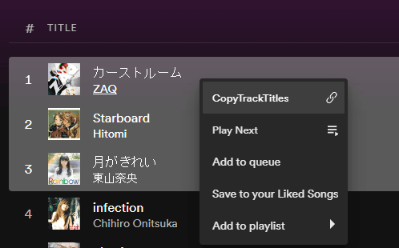

# CopyTrackTitles for [Spicetify](https://github.com/spicetify/spicetify-cli)

This adds a context menu entry to copy selected titles to clipboard.



You can tweak the format in the settings using these placeholders:

| Field           | Description                          |
| --------------- | ------------------------------------ |
| **`%ARTISTS%`** | List of artists, separated by commas |
| **`%ARTIST%`**  | First artist                         |
| **`%TITLE%`**   | Track title                          |

## Install / Update

Make sure you are using latest releases of Spicetify and Spotify

Copy `copy-track-titles.js` (found in the `dist` folder) into your [Spicetify/Extensions folder](https://spicetify.app/docs/advanced-usage/extensions#installing)

| Platform    | Path                                                                                 |
| ----------- | ------------------------------------------------------------------------------------ |
| **Linux**   | `~/.config/spicetify/Extensions` or `$XDG_CONFIG_HOME/.config/spicetify/Extensions/` |
| **MacOS**   | `~/.config/spicetify/Extensions` or `$SPICETIFY_CONFIG/Extensions`                   |
| **Windows** | `%userprofile%\.spicetify\Extensions`                                                |

You can also run `spicetify config-dir` to open the top directory in your file manager.


Run these commands:

```
spicetify config extensions copy-track-titles.js
spicetify apply
```

<aside class="notice">
    Note: The <code>config</code> command appends to the list of already-installed extensions. It does not replace the whole key's value.
</aside>

## Usage

* Select one or more tracks
* Right-click
* Select the menu entry
* Paste the contents wherever you want

## Uninstall

Run the `config` command with a minus sign after the filename:

```
spicetify config extensions copy-track-titles.js-
spicetify apply
```
